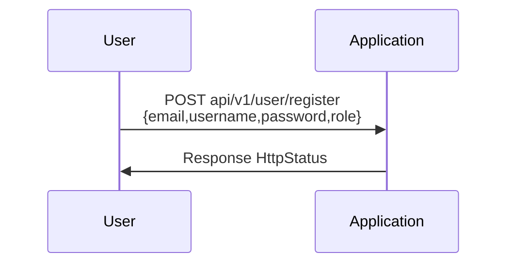
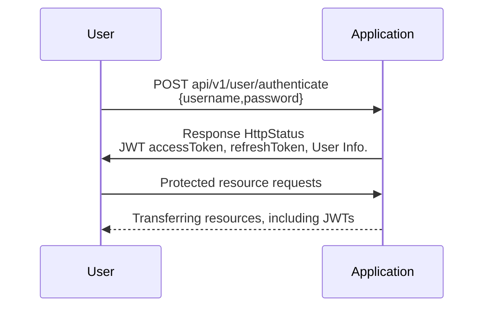

# Introduction
JWT-based authentication Backend Application

# Authentication process

- Registration



- Authenticate



# Getting Started

## Building
To build Docker image containing sample Spring Boot application run following command in terminal:
````bash
gradle wrapper
./gradlew build
````

## Running
To run built image run:
````bash
gradle run
````

# Reference Documentation
For further reference, please consider the following sections:

* [Official Gradle documentation](https://docs.gradle.org)
* [Spring Boot Gradle Plugin Reference Guide](https://docs.spring.io/spring-boot/docs/2.7.2/gradle-plugin/reference/html/)
* [Create an OCI image](https://docs.spring.io/spring-boot/docs/2.7.2/gradle-plugin/reference/html/#build-image)
* [Spring Data MongoDB](https://docs.spring.io/spring-boot/docs/2.7.2/reference/htmlsingle/#data.nosql.mongodb)
* [Spring Data JDBC](https://docs.spring.io/spring-boot/docs/2.7.2/reference/htmlsingle/#data.sql.jdbc)
* [Spring Web Services](https://docs.spring.io/spring-boot/docs/2.7.2/reference/htmlsingle/#io.webservices)
* [Spring Session](https://docs.spring.io/spring-session/reference/)
* [Spring Security](https://docs.spring.io/spring-boot/docs/2.7.2/reference/htmlsingle/#web.security)
* [Spring for Apache Kafka](https://docs.spring.io/spring-boot/docs/2.7.2/reference/htmlsingle/#messaging.kafka)

# Guides
The following guides illustrate how to use some features concretely:

* [Accessing Data with MongoDB](https://spring.io/guides/gs/accessing-data-mongodb/)
* [Using Spring Data JDBC](https://github.com/spring-projects/spring-data-examples/tree/master/jdbc/basics)
* [Producing a SOAP web service](https://spring.io/guides/gs/producing-web-service/)
* [Securing a Web Application](https://spring.io/guides/gs/securing-web/)
* [Spring Boot and OAuth2](https://spring.io/guides/tutorials/spring-boot-oauth2/)
* [Authenticating a User with LDAP](https://spring.io/guides/gs/authenticating-ldap/)

### Additional Links
These additional references should also help you:

* [Gradle Build Scans – insights for your project's build](https://scans.gradle.com#gradle)